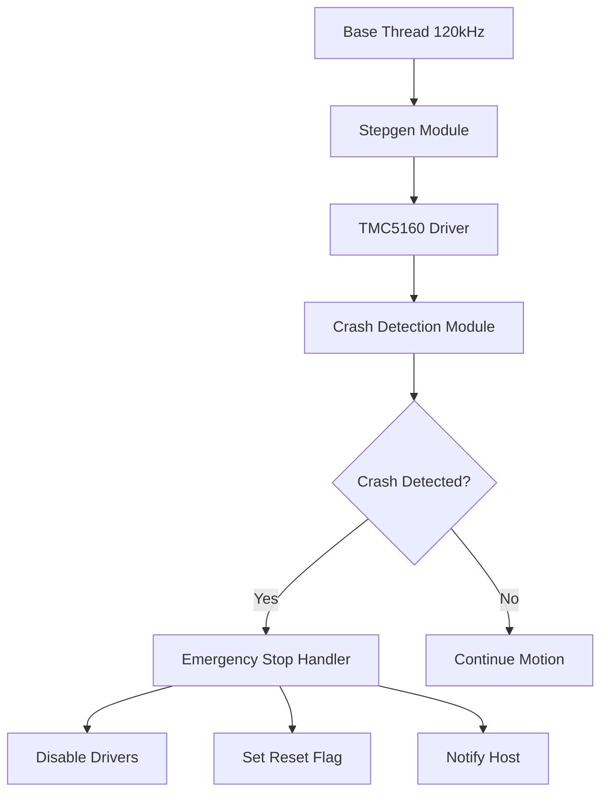

# TMC Sensorless Homing and Crash Detection - Detailed Implementation Plan

## Overview

This document provides a detailed implementation plan for **Option 4: Multi-Layer Protection System** with **runtime configuration** for the Remora STM32H7xx PIO system using TMC5160 drivers.

---

## System Architecture

### Multi-Layer Protection Diagram

```
┌─────────────────────────────────────────────────────────────────┐
│                    Motion Command                                │
└────────────────────────────┬────────────────────────────────────┘
                             │
                             v
┌─────────────────────────────────────────────────────────────────┐
│                    Stepgen Module                                │
│              (Generates step pulses)                             │
└────────────────────────────┬────────────────────────────────────┘
                             │
                             v
┌─────────────────────────────────────────────────────────────────┐
│              TMC5160 Driver Module                               │
│  ┌───────────────────────────────────────────────────────────┐  │
│  │  Layer 1: StallGuard2 Monitoring                           │  │
│  │  - Read SG_RESULT from DRV_STATUS register                │  │
│  │  - Compare against threshold                              │  │
│  │  - Debounce timer                                         │  │
│  └───────────────────────────────────────────────────────────┘  │
│  ┌───────────────────────────────────────────────────────────┐  │
│  │  Layer 2: Current Monitoring                               │  │
│  │  - Read MSCURACT register                                 │  │
│  │  - Detect current spikes (>2x nominal)                    │  │
│  │  - Correlate with StallGuard2                             │  │
│  └───────────────────────────────────────────────────────────┘  │
│  ┌───────────────────────────────────────────────────────────┐  │
│  │  Layer 3: Position Tracking                                │  │
│  │  - Monitor XACTUAL register                               │  │
│  │  - Detect unexpected movement                             │  │
│  │  - Compare with expected position                         │  │
│  └───────────────────────────────────────────────────────────┘  │
└────────────────────────────┬────────────────────────────────────┘
                             │
                             v
┌─────────────────────────────────────────────────────────────────┐
│              Crash Detection Handler                             │
│  - Aggregates all layer signals                                 │
│  - Validates crash condition                                    │
│  - Triggers emergency stop                                      │
└────────────────────────────┬────────────────────────────────────┘
                             │
                             v
┌─────────────────────────────────────────────────────────────────┐
│              Emergency Response                                  │
│  - Disable all TMC drivers                                      │
│  - Log crash event                                              │
│  - Notify host system                                           │
└─────────────────────────────────────────────────────────────────┘
```

---

## Component Design

### 1. Extended TMC5160 Module

**File:** `Src/remora/modules/tmc/tmc5160.cpp`

#### New Data Members
```cpp
class TMC5160 : public TMC {
    // ... existing members ...
    
    // StallGuard2 configuration
    uint8_t stallThreshold;           // 0-255, lower = more sensitive
    bool sgEnabled;                   // Enable/disable StallGuard2
    
    // Current monitoring
    float nominalCurrentA;            // Nominal current for layer 2
    float nominalCurrentB;
    float currentSpikeThreshold;      // Multiplier (e.g., 2.0 = 2x nominal)
    
    // Position tracking
    int32_t lastKnownPosition;        // For layer 3
    int32_t positionTolerance;        // Allowed deviation
    
    // Runtime configuration flags
    bool sensorlessHomingEnabled;
    bool crashDetectionEnabled;
    bool layer1Enabled;               // StallGuard2
    bool layer2Enabled;               // Current monitoring
    bool layer3Enabled;               // Position tracking
};
```

#### New Methods
```cpp
// StallGuard2 configuration
void setStallThreshold(uint8_t threshold);
uint8_t getStallThreshold();
int16_t getStallGuardResult();
void enableStallGuard(bool enable);
bool isStallGuardEnabled();

// Current monitoring
void setNominalCurrent(float currentA, float currentB);
void setCurrentSpikeThreshold(float threshold);
bool checkCurrentSpike();
int16_t getCurrentA();
int16_t getCurrentB();

// Position tracking
void setLastKnownPosition(int32_t position);
int32_t getLastKnownPosition();
void setPositionTolerance(int32_t tolerance);
bool checkPositionDeviation();

// Layer control
void enableLayer1(bool enable);
void enableLayer2(bool enable);
void enableLayer3(bool enable);
bool isLayer1Enabled();
bool isLayer2Enabled();
bool isLayer3Enabled();

// Multi-layer validation
bool validateCrashCondition();
CrashStatus getCrashStatus();
```

---

### 2. Homing Module

**File:** `Src/remora/modules/homing/homing.h`

```cpp
#ifndef HOMING_H
#define HOMING_H

#include "../../remora.h"
#include "../../modules/module.h"
#include <memory>

class Homing : public Module {
public:
    enum class Axis { X = 0, Y = 1, Z = 2, A = 3, B = 4, C = 5, D = 6, E = 7 };
    enum class HomingMode { SENSORLESS = 0, LIMIT_SWITCH = 1, HYBRID = 2 };
    enum class HomingState { IDLE, HOMING, RETREAT, COMPLETE, ERROR };
    
    struct HomingConfig {
        Axis axis;
        HomingMode mode;
        int32_t homingSpeed;        // mm/s for approach
        int32_t fineSpeed;          // mm/s for final approach
        uint8_t stallThreshold;     // 0-255 for TMC
        int32_t retreatDistance;    // mm to retreat after trigger
        int32_t retreatSpeed;       // mm/s for retreat
        bool invertDirection;       // Invert homing direction
        uint32_t maxTravel;         // Maximum travel distance (mm)
        uint32_t debounceTime;      // ms debounce for trigger
    };
    
    struct HomingResult {
        bool success;
        int32_t homePosition;
        HomingState state;
        uint32_t errorCode;
        uint32_t elapsedTime;       // ms
    };
    
    static std::shared_ptr<Module> create(const JsonObject& config, Remora* instance);
    
    // Configuration
    void setConfig(const HomingConfig& config);
    HomingConfig getConfig() const;
    void setAxis(Axis axis);
    Axis getAxis() const;
    void setMode(HomingMode mode);
    HomingMode getMode() const;
    
    // Execution
    void startHoming();
    void cancelHoming();
    HomingResult getResult();
    HomingState getState();
    bool isHomingComplete();
    bool isHomingActive();
    
    // Status
    int32_t getHomePosition();
    uint32_t getLastError();
    
private:
    Remora* instance;
    HomingConfig config;
    HomingState state;
    HomingResult result;
    uint32_t startTime;
    int32_t currentCount;
    bool active;
    
    void homingSequence();
    void retreatSequence();
    bool checkTriggerCondition();
    void handleTrigger();
    void handleError(uint32_t errorCode);
};

#endif
```

---

### 3. Crash Detection Module

**File:** `Src/remora/modules/crashDetection/crashDetection.h`

```cpp
#ifndef CRASHDETECTION_H
#define CRASHDETECTION_H

#include "../../remora.h"
#include "../../modules/module.h"
#include <memory>
#include <vector>

class CrashDetection : public Module {
public:
    enum class Layer { STALLGUARD2 = 0, CURRENT_SPIKE = 1, POSITION_DEVIATION = 2 };
    enum class CrashState { IDLE, DETECTING, CONFIRMED, TRIGGERED, RESET };
    
    struct LayerConfig {
        bool enabled;
        uint32_t debounceTime;      // ms
        uint32_t confirmationCount; // Number of consecutive triggers
    };
    
    struct CrashConfig {
        LayerConfig layer1;         // StallGuard2
        LayerConfig layer2;         // Current spike
        LayerConfig layer3;         // Position deviation
        bool requireMultipleLayers; // Require 2+ layers to trigger
        bool enableImmediateStop;   // Disable drivers immediately
        bool enableLogging;         // Log all events
        bool enableNotifications;   // Notify host system
    };
    
    struct CrashEvent {
        uint32_t timestamp;
        uint32_t layersTriggered;   // Bitmask of layers
        int16_t stallGuardResult;
        int16_t currentA;
        int16_t currentB;
        int32_t positionDeviation;
    };
    
    static std::shared_ptr<Module> create(const JsonObject& config, Remora* instance);
    
    // Configuration
    void setConfig(const CrashConfig& config);
    CrashConfig getConfig() const;
    void setLayerEnabled(Layer layer, bool enabled);
    bool isLayerEnabled(Layer layer);
    void setLayerDebounceTime(Layer layer, uint32_t ms);
    void setRequireMultipleLayers(bool require);
    
    // Execution
    void enable(bool enable);
    bool isEnabled();
    void reset();
    
    // Status
    CrashState getState();
    bool isCrashDetected();
    bool isCrashConfirmed();
    bool isCrashTriggered();
    
    // Event handling
    CrashEvent getLastEvent();
    uint32_t getEventCount();
    void clearEventCount();
    
    // Layer status
    bool isLayer1Triggered();
    bool isLayer2Triggered();
    bool isLayer3Triggered();
    uint32_t getLayerTriggerCount(Layer layer);
    
private:
    Remora* instance;
    CrashConfig config;
    CrashState state;
    CrashEvent lastEvent;
    uint32_t eventCount;
    bool enabled;
    
    // Layer state
    bool layer1Triggered;
    bool layer2Triggered;
    bool layer3Triggered;
    uint32_t layer1Count;
    uint32_t layer2Count;
    uint32_t layer3Count;
    uint32_t layer1DebounceStart;
    uint32_t layer2DebounceStart;
    uint32_t layer3DebounceStart;
    
    void update();
    void checkLayer1();
    void checkLayer2();
    void checkLayer3();
    void validateCrashCondition();
    void triggerCrash();
    void logEvent();
    void notifyHost();
};

#endif
```

---

### 4. JSON Configuration Handler Extensions

**File:** `Src/remora/json/jsonConfigHandler.cpp`

Add configuration parsing for:

```json
{
  "TMC5160": {
    "Comment": "Z Axis Driver",
    "CS pin": "PC4",
    "MOSI pin": "PC12",
    "MISO pin": "PC11",
    "SCK pin": "PC10",
    "Address": 0,
    "RSense": 0.075,
    "Current": 2000,
    "Hold current": 0.5,
    "Microsteps": 16,
    "Driver mode": 2,
    "Stall sensitivity": 10,
    
    "Sensorless homing": {
      "enabled": true,
      "homingSpeed": 100,
      "fineSpeed": 10,
      "retreatDistance": 5,
      "retreatSpeed": 50,
      "invertDirection": false,
      "maxTravel": 100,
      "debounceTime": 10
    },
    
    "Crash detection": {
      "enabled": true,
      "requireMultipleLayers": false,
      "enableImmediateStop": true,
      "enableLogging": true,
      "enableNotifications": true,
      
      "layer1": {
        "enabled": true,
        "debounceTime": 10,
        "confirmationCount": 3
      },
      
      "layer2": {
        "enabled": true,
        "debounceTime": 5,
        "confirmationCount": 2
      },
      
      "layer3": {
        "enabled": true,
        "debounceTime": 20,
        "confirmationCount": 5
      }
    }
  }
}
```

---

### 5. Communication Interface

**File:** `Src/remora/comms/commsInterface.h`

Add commands for homing and crash detection:

```cpp
enum class Command {
    // ... existing commands ...
    
    // Homing commands
    CMD_HOMING_START = 0x50,
    CMD_HOMING_CANCEL = 0x51,
    CMD_HOMING_STATUS = 0x52,
    CMD_HOMING_SET_CONFIG = 0x53,
    CMD_HOMING_GET_CONFIG = 0x54,
    
    // Crash detection commands
    CMD_CRASH_ENABLE = 0x60,
    CMD_CRASH_DISABLE = 0x61,
    CMD_CRASH_RESET = 0x62,
    CMD_CRASH_STATUS = 0x63,
    CMD_CRASH_GET_EVENT = 0x64,
    CMD_CRASH_SET_CONFIG = 0x65,
    CMD_CRASH_GET_CONFIG = 0x66,
    
    // TMC configuration commands
    CMD_TMC_SET_STALL_THRESHOLD = 0x70,
    CMD_TMC_GET_STALL_THRESHOLD = 0x71,
    CMD_TMC_GET_SG_RESULT = 0x72,
    CMD_TMC_GET_CURRENT = 0x73,
    CMD_TMC_ENABLE_LAYER = 0x74,
    CMD_TMC_DISABLE_LAYER = 0x75,
};
```

---

## Integration Points

### Thread Integration



### Interrupt Integration

```cpp
// In Src/remora/interrupt/interrupt.cpp
void crashDetectionInterrupt() {
    // High-priority interrupt for immediate crash response
    if (crashDetection->isCrashTriggered()) {
        // Disable all TMC drivers immediately
        disableAllDrivers();
        
        // Set system reset flag
        *remora->getReset() = true;
    }
}
```

---

## Implementation Steps

### Phase 1: TMC5160 Extensions (Week 1)

1. Add StallGuard2 methods to TMC5160 class
2. Add current monitoring methods
3. Add position tracking methods
4. Add layer enable/disable methods
5. Add multi-layer validation method
6. Test individual layer functionality

### Phase 2: Homing Module (Week 2)

1. Create Homing class with configuration
2. Implement sensorless homing sequence
3. Implement limit switch homing sequence
4. Implement hybrid homing sequence
5. Add state machine for homing process
6. Test homing on single axis

### Phase 3: Crash Detection Module (Week 3)

1. Create CrashDetection class with configuration
2. Implement Layer 1 (StallGuard2) monitoring
3. Implement Layer 2 (Current spike) monitoring
4. Implement Layer 3 (Position deviation) monitoring
5. Implement multi-layer validation
6. Implement emergency stop sequence
7. Test crash detection on each layer

### Phase 4: JSON Configuration (Week 4)

1. Extend JsonConfigHandler for homing config
2. Extend JsonConfigHandler for crash detection config
3. Add runtime configuration methods
4. Test configuration loading and updates

### Phase 5: Communication Interface (Week 5)

1. Add homing commands to commsInterface
2. Add crash detection commands to commsInterface
3. Implement command handlers
4. Test command execution

### Phase 6: Integration and Testing (Week 6)

1. Integrate with existing Remora system
2. Test full homing sequence
3. Test full crash detection sequence
4. Performance optimization
5. Documentation

---

## Testing Plan

### Unit Tests

1. **TMC5160 Layer Tests**
   - StallGuard2 threshold setting
   - Current reading accuracy
   - Position tracking accuracy
   - Layer enable/disable

2. **Homing Module Tests**
   - Sensorless homing sequence
   - Limit switch homing sequence
   - Hybrid homing sequence
   - Error handling

3. **Crash Detection Tests**
   - Layer 1 trigger validation
   - Layer 2 trigger validation
   - Layer 3 trigger validation
   - Multi-layer validation
   - Debounce timing

### Integration Tests

1. **Homing Integration**
   - Single axis homing
   - Multi-axis coordinated homing
   - Homing with runtime config changes

2. **Crash Detection Integration**
   - Simulated crash on each layer
   - Multi-layer crash detection
   - Emergency stop response time
   - System recovery

### Performance Tests

1. **Response Time**
   - StallGuard2 detection latency
   - Current spike detection latency
   - Emergency stop response time

2. **CPU Overhead**
   - Baseline CPU usage
   - With homing module
   - With crash detection module

---

## Risk Mitigation

| Risk | Mitigation |
|------|------------|
| False positive crash detection | Implement multi-layer validation with configurable debounce |
| Homing fails to find limit | Implement max travel limit with timeout |
| Performance degradation | Profile CPU usage, optimize critical paths |
| Configuration errors | Validate all config values at startup |
| Driver communication issues | Implement retry logic with timeout |

---

## Configuration Defaults

```cpp
// TMC5160 defaults
constexpr uint8_t DEFAULT_STALL_THRESHOLD = 64;
constexpr float DEFAULT_CURRENT_SPIKE_THRESHOLD = 2.0f;
constexpr int32_t DEFAULT_POSITION_TOLERANCE = 100;

// Homing defaults
constexpr int32_t DEFAULT_HOMING_SPEED = 100;       // mm/s
constexpr int32_t DEFAULT_FINE_SPEED = 10;          // mm/s
constexpr int32_t DEFAULT_RETREAT_DISTANCE = 5;     // mm
constexpr int32_t DEFAULT_RETREAT_SPEED = 50;       // mm/s
constexpr uint32_t DEFAULT_MAX_TRAVEL = 100;        // mm
constexpr uint32_t DEFAULT_DEBOUNCE_TIME = 10;      // ms

// Crash detection defaults
constexpr uint32_t DEFAULT_LAYER1_DEBOUNCE = 10;    // ms
constexpr uint32_t DEFAULT_LAYER1_CONFIRMATION = 3; // counts
constexpr uint32_t DEFAULT_LAYER2_DEBOUNCE = 5;     // ms
constexpr uint32_t DEFAULT_LAYER2_CONFIRMATION = 2; // counts
constexpr uint32_t DEFAULT_LAYER3_DEBOUNCE = 20;    // ms
constexpr uint32_t DEFAULT_LAYER3_CONFIRMATION = 5; // counts
```

---

## Next Steps

1. **Review this plan** - Confirm all components and integration points
2. **Approve architecture** - Switch to Code mode for implementation
3. **Begin implementation** - Start with Phase 1 (TMC5160 extensions)
