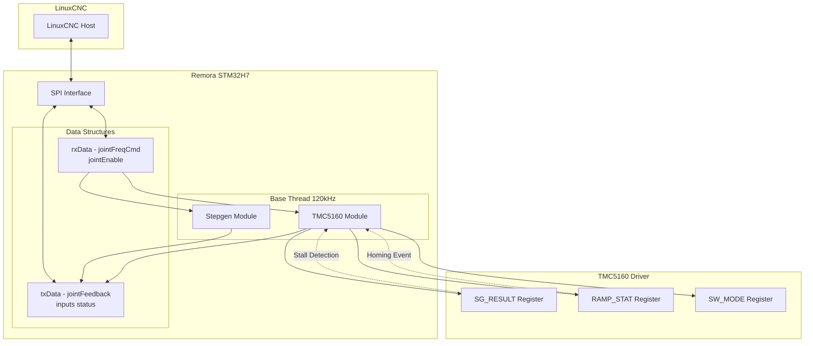
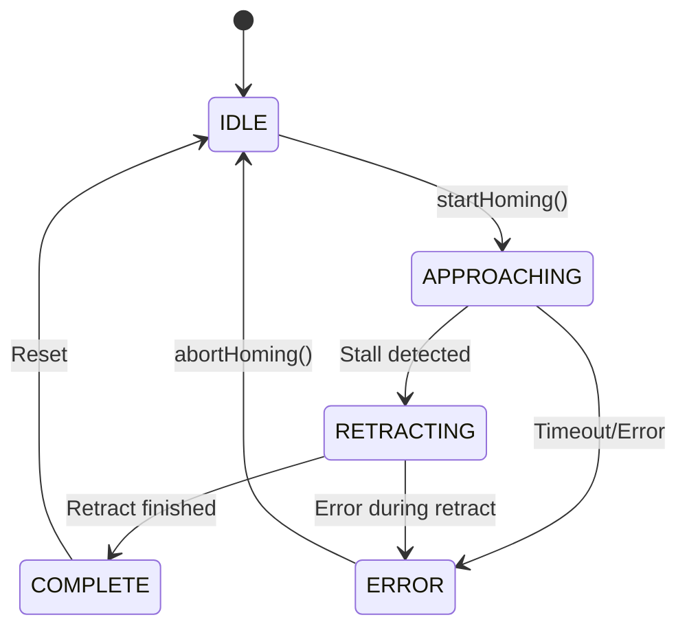

# TMC5160 Sensorless Homing and Crash Detection Implementation Plan

## Overview

This document outlines the implementation of TMC5160 sensorless homing and crash detection features for the Remora STM32H7xx motion controller. The implementation leverages the TMC5160's built-in StallGuard2 technology and software ramp generator for robust, configurable homing and crash detection.

## TMC5160 Capabilities Analysis

### Key Registers for Sensorless Homing

| Register | Address | Purpose | Key Bits |
|----------|---------|---------|----------|
| `GCONF` | 0x00 | Global configuration | `diag0_stall`, `diag1_stall`, `diag0_int_pushpull`, `diag1_pushpull` |
| `SGTHRS` | 0x40 | StallGuard threshold | 8-bit threshold (0-255, higher = more sensitive) |
| `SG_RESULT` | 0x41 | StallGuard result | 10-bit measurement (lower = higher load) |
| `SW_MODE` | 0x34 | Software ramp mode | `sg_stop`, `stop_l_enable`, `stop_r_enable`, `pol_stop_l`, `pol_stop_r` |
| `RAMP_STAT` | 0x35 | Ramp status | `event_stop_sg`, `status_sg`, `status_stop_l`, `status_stop_r` |
| `DRV_STATUS` | 0x6F | Driver status | `sg_result`, `stallGuard` flag |

### StallGuard2 Operation

- **SG_RESULT**: 10-bit value (0-1023) representing back-EMF measurement
  - Lower values = higher motor load (potential stall/crash)
  - Higher values = lower motor load (free running)
  - Typical free-running value: 700-900
  - Stall threshold: Configurable via SGTHRS register

- **SGTHRS**: 8-bit threshold (0-255)
  - Formula: `stall_threshold = SGTHRS * 4` (scaled to 10-bit range)
  - When `SG_RESULT < (SGTHRS * 4)`, stall condition is detected

## Architecture



## Configuration Schema

### TMC5160 Module Configuration (JSON)

```json
{
  "Module": "TMC5160",
  "Comment": "Axis X TMC5160 Driver",
  "CS pin": "PE2",
  "MOSI pin": "PE1",
  "MISO pin": "PD7",
  "SCK pin": "PE0",
  "Address": 0,
  "RSense": 0.075,
  "Current": 2000,
  "Hold current": 1000,
  "Microsteps": 256,
  "Driver mode": 1,
  
  "Stall sensitivity": 200,
  
  "Sensorless Homing": {
    "Enabled": true,
    "HomingThreshold": 180,
    "HomingSpeed": 1000,
    "HomingDirection": -1,
    "RetractDistance": 1000,
    "RetractSpeed": 200,
    "DebounceCount": 5,
    "UseHardwareStop": false
  },
  
  "Crash Detection": {
    "Enabled": true,
    "CrashThreshold": 150,
    "DebounceCount": 3,
    "MinVelocity": 100,
    "Action": "estop",
    "ReportToLinuxCNC": true
  }
}
```

### Configuration Parameters

#### Sensorless Homing Parameters

| Parameter | Type | Default | Description |
|-----------|------|---------|-------------|
| `Enabled` | bool | false | Enable sensorless homing |
| `HomingThreshold` | uint8_t | 200 | SGTHRS value for homing (0-255) |
| `HomingSpeed` | uint32_t | 1000 | Steps/sec during homing approach |
| `HomingDirection` | int8_t | -1 | Direction: -1 (negative), 1 (positive) |
| `RetractDistance` | int32_t | 1000 | Steps to retract after homing |
| `RetractSpeed` | uint32_t | 200 | Steps/sec during retract |
| `DebounceCount` | uint8_t | 5 | Consecutive detections required |
| `UseHardwareStop` | bool | false | Use TMC5160 internal sg_stop feature |

#### Crash Detection Parameters

| Parameter | Type | Default | Description |
|-----------|------|---------|-------------|
| `Enabled` | bool | false | Enable crash detection |
| `CrashThreshold` | uint8_t | 150 | SGTHRS value for crash (0-255) |
| `DebounceCount` | uint8_t | 3 | Consecutive detections required |
| `MinVelocity` | uint32_t | 100 | Minimum velocity to detect crash |
| `Action` | string | "stop" | Response: "stop", "estop", "report" |
| `ReportToLinuxCNC` | bool | true | Report crash via SPI status |

## Implementation Details

### 1. Extended TMC5160 Class (tmc.h)

```cpp
class TMC5160 : public TMC
{
protected:
    // Existing members...
    std::string pinCS, pinMOSI, pinMISO, pinSCK;
    uint8_t addr;
    uint16_t mA, microsteps, mode, stall;
    float holdCurrent;
    std::unique_ptr<TMC5160Stepper> driver;
    
    // New: Sensorless homing members
    struct HomingConfig {
        bool enabled = false;
        uint8_t threshold = 200;
        uint32_t speed = 1000;
        int8_t direction = -1;
        int32_t retractDistance = 1000;
        uint32_t retractSpeed = 200;
        uint8_t debounceCount = 5;
        bool useHardwareStop = false;
    };
    
    struct CrashConfig {
        bool enabled = false;
        uint8_t threshold = 150;
        uint8_t debounceCount = 3;
        uint32_t minVelocity = 100;
        std::string action = "stop";
        bool reportToLinuxCNC = true;
    };
    
    HomingConfig homingConfig;
    CrashConfig crashConfig;
    
    // Homing state machine
    enum class HomingState { IDLE, APPROACHING, RETRACTING, COMPLETE, ERROR };
    HomingState homingState = HomingState::IDLE;
    uint8_t homingDebounce = 0;
    int32_t homingPosition = 0;
    
    // Crash detection state
    uint8_t crashDebounce = 0;
    bool crashDetected = false;
    uint32_t lastSGResult = 0;

public:
    TMC5160(/* existing params */, HomingConfig _homing, CrashConfig _crash, Remora*);
    
    void configure(void) override;
    void update(void) override;
    
    // Status accessors
    bool isHomingComplete() const { return homingState == HomingState::COMPLETE; }
    bool isCrashDetected() const { return crashDetected; }
    uint16_t getSGResult() const { return lastSGResult; }
    void clearCrashFlag();
    void startHoming();
    void abortHoming();
};
```

### 2. Homing State Machine



### 3. Update Loop Logic (tmc5160.cpp)

```cpp
void TMC5160::update()
{
    // Read StallGuard result
    uint16_t sgResult = driver->sg_result();
    lastSGResult = sgResult;
    
    // Homing state machine
    if (homingConfig.enabled && homingState != HomingState::IDLE)
    {
        handleHomingState(sgResult);
    }
    
    // Crash detection (only if not homing)
    if (crashConfig.enabled && homingState == HomingState::IDLE)
    {
        handleCrashDetection(sgResult);
    }
    
    // Update status feedback to LinuxCNC
    updateStatusFeedback();
}

void TMC5160::handleHomingState(uint16_t sgResult)
{
    switch (homingState)
    {
        case HomingState::APPROACHING:
            if (sgResult < (homingConfig.threshold * 4))
            {
                homingDebounce++;
                if (homingDebounce >= homingConfig.debounceCount)
                {
                    homingPosition = getCurrentPosition();
                    homingState = HomingState::RETRACTING;
                    homingDebounce = 0;
                }
            }
            break;
            
        case HomingState::RETRACTING:
            // Handle retract logic
            if (retractComplete())
            {
                homingState = HomingState::COMPLETE;
            }
            break;
    }
}

void TMC5160::handleCrashDetection(uint16_t sgResult)
{
    uint32_t currentVelocity = getCurrentVelocity();
    
    if (currentVelocity >= crashConfig.minVelocity)
    {
        if (sgResult < (crashConfig.threshold * 4))
        {
            crashDebounce++;
            if (crashDebounce >= crashConfig.debounceCount)
            {
                crashDetected = true;
                executeCrashAction();
            }
        }
        else
        {
            crashDebounce = 0;
        }
    }
    else
    {
        crashDebounce = 0;
    }
}

void TMC5160::executeCrashAction()
{
    if (crashConfig.action == "estop")
    {
        // Trigger emergency stop
        instance->triggerEStop();
    }
    else if (crashConfig.action == "stop")
    {
        // Disable joint
        instance->disableJoint(jointNumber);
    }
    
    if (crashConfig.reportToLinuxCNC)
    {
        // Set status bit in txData
        instance->getTxData()->inputs |= (1 << jointNumber);
    }
}
```

### 4. Hardware Stop Mode (Optional)

When `UseHardwareStop` is enabled, configure TMC5160's internal stop feature:

```cpp
// In configure()
if (homingConfig.useHardwareStop)
{
    // Configure SW_MODE for StallGuard stop
    driver->sg_stop(true);  // Enable StallGuard stop
    
    // Configure stop polarity based on homing direction
    if (homingConfig.direction < 0)
    {
        driver->stop_l_enable(true);
        driver->pol_stop_l(false);  // Active low
    }
    else
    {
        driver->stop_r_enable(true);
        driver->pol_stop_r(false);  // Active low
    }
    
    // Set threshold
    driver->SGTHRS(homingConfig.threshold);
}
```

### 5. Status Feedback Integration

Extend txData structure to include TMC status:

```cpp
// In data.h - extend existing structure
struct
{
    int32_t header;
    int32_t jointFeedback[Config::joints];
    float processVariable[Config::variables];
    uint16_t inputs;           // Existing: digital inputs
    uint16_t tmcStatus;        // New: TMC status bits
    uint8_t spare0;
    uint8_t spare1;
};

// TMC status bit definitions
#define TMC_STATUS_HOMING_COMPLETE  0  // Bit 0: Homing complete
#define TMC_STATUS_CRASH_DETECTED   1  // Bit 1: Crash detected
#define TMC_STATUS_STALL_GUARD      2  // Bit 2: StallGuard active
```

## Integration with Stepgen

The TMC5160 module should communicate with the Stepgen module for coordinated homing:

```cpp
// Option 1: TMC5160 controls Stepgen during homing
void TMC5160::startHoming()
{
    homingState = HomingState::APPROACHING;
    
    // Request Stepgen to move at homing speed
    instance->setJointFrequency(jointNumber, homingConfig.speed * homingConfig.direction);
}

// Option 2: Stepgen queries TMC5160 for homing status
bool Stepgen::isHomingComplete()
{
    auto tmc = instance->getTMCModule(jointNumber);
    return tmc && tmc->isHomingComplete();
}
```

## Testing Checklist

- [ ] Verify SG_RESULT readings at various motor loads
- [ ] Calibrate SGTHRS threshold for specific motor/load combination
- [ ] Test homing approach and retract sequence
- [ ] Test crash detection with simulated obstruction
- [ ] Verify debounce filtering prevents false positives
- [ ] Test all crash response actions (stop, estop, report)
- [ ] Verify status feedback to LinuxCNC
- [ ] Test hardware stop mode (if enabled)

## References

- [TMC5160 Datasheet](https://www.trinamic.com/file-admin/assets/Products/ICs/Datasheets/TMC5160.pdf)
- [TMCStepper Library](https://github.com/teemuatlut/TMCStepper)
- [StallGuard2 Application Note](https://www.trinamic.com/products/integrated-cics/ic-series/tmc5160/)
